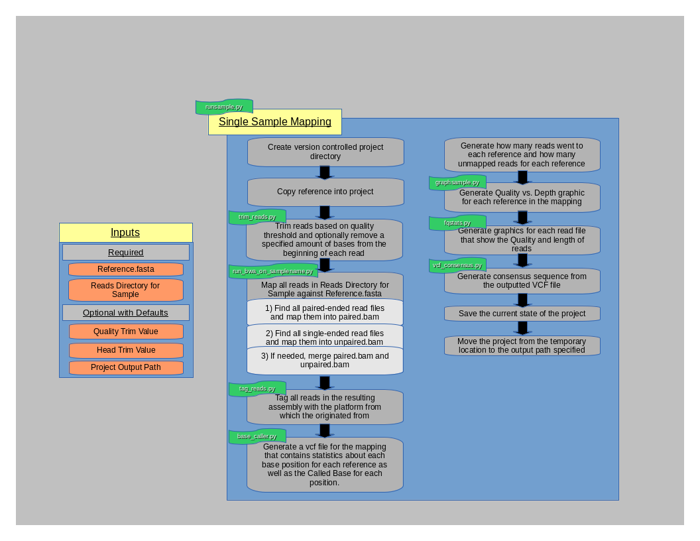

=============
Pipeline Info
=============

.. _pipeline-output:

Pipeline Output
===============

The pipeline can be run as a batch job or it can be run individually. That is, you can run it on many samples by supplying a :doc:`samplesheet` to :doc:`runsamplesheet.sh <scripts/runsamplesheet>` or a single sample can be run via :py:mod:`runsample <miseqpipeline.runsample>`.
As such, you need to understand that [[runsamplesheet.sh]] essentially just runs :py:mod:`runsample <miseqpipeline.runsample>` for every sample in your [[samplesheet]] then runs a few graphics scripts afterwards on all the completed projects.

* Individual sample project directories under Projects/
    * :ref:`runsample.py <runsample-output-directory>` output
* Entire Project output
    * :doc:`scripts/graphs` output
