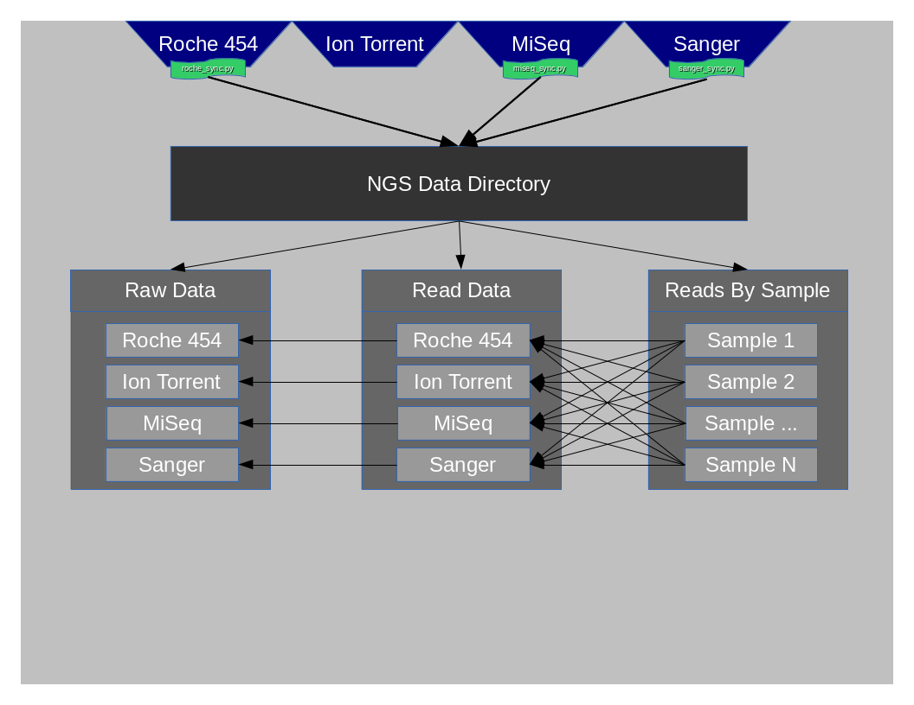

==============
Data Structure
==============

At this time data is organized inside of what is called the NGS Data Structure. This structure is composed of 3 critical directories.

* RawData
* ReadData
* ReadsBySample

Getting Data into the data structure
====================================

See :doc:`ngsdatasync`

Diagram
=======

RawData
=======

RawData is composed of all files that originate from each of the instruments' Run.
Some instruments may create ReadData as well or very close to ReadData, but it is still considered RawData.

Some examples of RawData would be:

* Run_3130xl\_ directories containing \*.ab1 files(Sanger)
* Directories under the MiSeqOutput directory(MiSeq)
* R\_\* directories containing signalProcessing or fullProcessing directories(Roche)

ReadData
========

ReadData is any sequence file format that can be utilized by NGS mapping/assembly applications.
At this time these file formats typically end with the following extensions:

    .ab1
    .sff
    .fastq

ReadsBySample
=============

This directory contains only directories that are named after each of the samplenames that have been sequenced. The concept of this folder is to make it very easy to look up all data related to a given samplename.o

.. _platformidentification:

Platform Identification
=======================

See the following naming regular expressions defined in :py:mod:`ngs_mapper.data` for more information about how platforms are identified via the read identifiers inside the files

* :py:mod:`sanger <ngs_mapper.data.SANGER_ID>`
* :py:mod:`miseq <ngs_mapper.data.MISEQ_ID>`
* :py:mod:`roche <ngs_mapper.data.ROCHE_ID>`
* :py:mod:`iontorrent <ngs_mapper.data.IONTORRENT_ID>`

If you have files that do not match any platform the pipeline will essentially ignore them and you may get errors when you run :py:mod:`runsample <ngs_mapper.runsample>`.

This should only be an issue if you somehow rename the identifiers.
